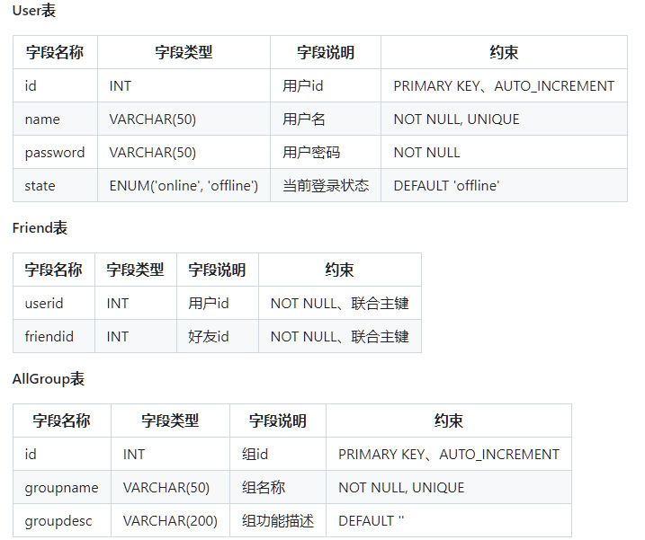
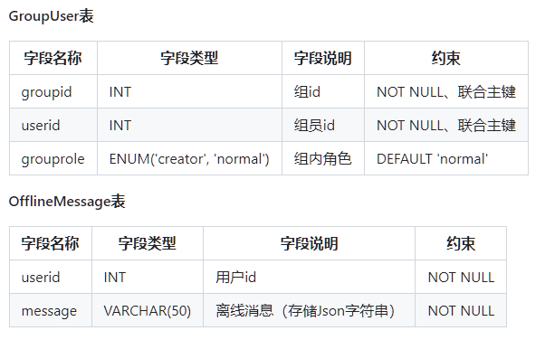
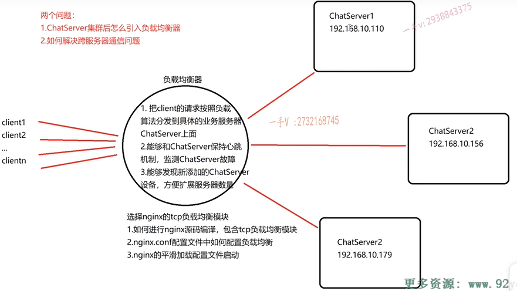

- [一、环境配置](#一环境配置)
- [二、项目库介绍](#二项目库介绍)
  - [2.1 Json](#21-json)
    - [2.1.1 json 介绍](#211-json-介绍)
    - [2.1.2 一个优秀的 Json 三方库](#212-一个优秀的-json-三方库)
    - [2.1.3 使用 json 库](#213-使用-json-库)
  - [2.2 muduo 网络库编程](#22-muduo-网络库编程)
    - [2.2.1 muduo 源码编译安装](#221-muduo-源码编译安装)
    - [2.2.2 基于 muduo 的客户端服务器编程](#222-基于-muduo-的客户端服务器编程)
  - [2.3 CMake](#23-cmake)
- [三、项目流程](#三项目流程)
  - [3.1 mysql 数据库](#31-mysql-数据库)
    - [3.1.1 修改 root 的密码](#311-修改-root-的密码)
    - [3.1.2 mysql 语法回顾](#312-mysql-语法回顾)
    - [数据表中插入中文数据失败](#数据表中插入中文数据失败)
    - [3.1.3 设计数据表](#313-设计数据表)
  - [3.2 模块设计](#32-模块设计)

reference：[集群聊天服务器-软件分层设计和高性能服务开发](https://www.bilibili.com/video/BV1114y117Yh)、[课件-提取码: qkng ](https://pan.baidu.com/s/1AQnSgSktA-ZBqIDMik8OvQ?pwd=qkng)

# 一、环境配置

## 1.1 安装 nginx

```bash
# 2. 解压 nginx 安装包
#tar -zvxf nginx-1.12.2.tar.gz

# 3. 配置 nginx
#./configure --with-stream

# 4. 编译并安装在 /usr/local/nginx 目录
#make && make install
# 1. 安装 nginx 依赖
sudo apt-get update
sudo apt-get install build-essential libpcre3 libpcre3-dev zlib1g zlib1g-dev libssl-dev
# 以上使用1.12.3版本编译出现问题，直接只用下面的命令来编译安装
wget http://nginx.org/download/nginx-1.24.0.tar.gz
tar -zxvf nginx-1.24.0.tar.gz
cd nginx-1.24.0
./configure --with-stream
make
sudo make install
```

```nginx
# nginx tcp loadbalance config
stream {
        # 负载均衡模块
        upstream MyServer{
                # 服务器名称 服务器ip:端口号 权重=1 max_fails=x fail_timeout=s
                # 上述权重=1，表示轮询的请求
                # max_fails=3表示和ChatServer保持心跳机制，超过3次失败表示服务器挂掉了
                # fail_timeout=30s，响应时间超过30s表示失败了
                server 127.0.0.1:6000 weight=1 max_fails=3 fail_timeout=30s;
                server 127.0.0.1:6002 weight=1 max_fails=3 fail_timeout=30s;
        }

        server{
                proxy_connect_timeout 1s;
                # proxy_timeout 3s;
                listen 8000; # 表示ngnix会监听的端口号
                proxy_pass MyServer; # 表示标记
                tcp_nodelay on;
        }
}
```


参考视频[01-04](https://www.bilibili.com/video/BV1114y117Yh?p=1&vd_source=93d2c7cab25a2966d2b5d0ccf80348c8)

# 二、项目库介绍

## 2.1 Json 

参考视频[05-07](https://www.bilibili.com/video/BV1114y117Yh?p=5&vd_source=93d2c7cab25a2966d2b5d0ccf80348c8)

### 2.1.1 json 介绍

`Json` 是一种轻量级的数据交换格式(也叫数据序列化方式)。`Json` 采用**完全独立于编程语言的文本格式来存储和表示数据**。简洁和清晰的层次结构使得 `Json` 成为理想的数据交换语言。 易于人阅读和编写，同时也易于机器解析和生成，并有效地提升网络传输效率。


### 2.1.2 一个优秀的 Json 三方库

JSON for Modern C++ 是一个由德国大佬 `nlohmann` 编写的，在 C++ 下使用的 JSON 库。

具有以下特点：

* 1）直观的语法。
* 2）整个代码由一个头文件 `json.hpp` 组成，没有子项目，也没有依赖关系和复杂的构建系统，使用起来非常方便。
* 3）使用 `C++11` 标准编写；像使用 `STL` 容器一样使用 `json` 库，并且 `STL` 和 `json` 库之间可以相互转换。
* 4）严谨的测试：所有类都经过严格的单元测试，覆盖了 `100%` 的代码，包括所有特殊的行为。此外，还检查了 `Valgrind` 是否有内存泄漏。为了保持高质量，该项目遵循核心基础设施倡议(`CII`)的最佳实践


### 2.1.3 使用 json 库

* 1）需要包含 json 的头文件
* 2）Json 数据序列化
* 3）Json 数据的反序列化


## 2.2 muduo 网络库编程

参考视频[08-09](https://www.bilibili.com/video/BV1114y117Yh?p=9&vd_source=93d2c7cab25a2966d2b5d0ccf80348c8)

### 2.2.1 muduo 源码编译安装

参考链接：[Linux平台下muduo网络库源码编译安装](https://blog.csdn.net/QIANGWEIYUAN/article/details/89023980)


### 2.2.2 基于 muduo 的客户端服务器编程

`muduo` 库的使用需要链接：`libmuduo_base.so`、`libmuduo_net.so`、`libpthread.so`。链接的时候需要使用：`-Imuduo_base`、`-Imuduo_net`、`-Ipthread` 这些编译命令。

`muduo` 网络库给用户主要提供了两个类：

* `class TcpServer`：用于编写服务器程序的。
* `class TcpClient`：用于编写客户端程序的。

考虑一个问题：使用 `epoll + 线程池`  如何去设计服务器网络模型呢？

* 实际上这些网络库将 `epoll + 线程池` 结构给封装起来了。好处是：**能够把网络 I/O 的代码和业务代码区分开**，让用户直接使用网络库，其主要精力放在业务代码的开发上面。
* 业务代码主要会暴露两方面：**1.  用户的连接和断开**；**2. 用户的可读写事件**。

***

`telnet` 是一个用于在计算机之间建立交互式通信会话的网络协议和命令行工具。它通常用于以下目的：

1. **测试网络连接**：通过 `telnet` 命令，可以测试计算机和远程主机之间的连接是否正常。比如，检查某个端口是否开放。
2. **远程管理**：在早期，`telnet` 常用于远程登录到其他计算机，执行管理任务。但由于它不加密通信数据，现在不再推荐用于这个目的。
3. **调试和诊断**：网络管理员和开发人员使用 `telnet` 来调试网络服务和应用程序，确保它们按预期工作。

***

补充 g++ 编译命令的选项：

```bash
-I头文件搜索路径 -L库文件搜索路径 -lmuduo_net(搜索库的名称)
默认搜索路径为 /usr/include、/usr/local/include，不需要加文件搜索路径，因为是默认的
```


## 2.3 CMake

参考视频[10-13](https://www.bilibili.com/video/BV1114y117Yh/?p=13&spm_id_from=pageDriver&vd_source=93d2c7cab25a2966d2b5d0ccf80348c8)

**CMake 简介：**

* 使用简单方便，可以跨平台，构建项目编译环境。尤其比直接写 `Makefile` 简单(在构建大型工程编译时，需要写大量的文件依赖关系)，可以通过简单的 `CMake` 生成负责的 `Makefile` 文件。

**CMake 安装：**

```shell
# ubuntu 系统上安装
sudo apt install cmake
# 查看 cmake 版本
cmake -version
```


`g++` `-o` **可执行文件名/动态库/静态库**  [**编译选项**]  **源文件** `-I`[**指定头文件搜索路径**] `-L`[**指定库文件路径**]  `-l`[**指定链接库文件**]

`g++ -o server.out -g muduo_server.cpp xxx.cpp -I/usr/include -L/usr/lib -lmuduo_net -lmuduo_base -lpthread`

更多 CMake 问题，请看[CMake使用简介](./CMake使用简介.pdf)。


# 三、项目流程

**补充小知识**：

```bash
# **查看网络连接和端口使用情况
sudo netstat -tanp
```

`sudo netstat -tanp` 是一个用于**查看网络连接和端口使用情况的命令**，具体选项的含义如下：

- `sudo`：以超级用户（root）权限运行命令，因为有些网络连接信息只有超级用户才能查看。
- `netstat`：网络统计工具，显示网络连接、路由表、接口统计、伪装连接、多播成员等。
- `t`：仅显示 TCP 连接。
- `a`：显示所有连接和监听端口。
- `n`：以数字形式显示地址和端口号，而不是尝试解析主机名和服务名。
- `p`：显示使用连接的程序的 PID 和名称。

## 3.1 mysql 数据库

### 3.1.1 修改 root 的密码

```bash
# 0. 查看mysql状态，是否开启mysql服务器
sudo service mysql status
# 若没有开启，则开启一下。只有开启了 mysql 服务才能进行以下操作。
sudo service mysql start
# 也可以使用 netstat 来查看 mysql 的网络连接和端口号是否存在来判断是否开启mysql服务器
sudo netstat -tanp
# 1. 查看 mysql默认账号和密码：
sudo cat /etc/mysql/debian.cnf

# Automatically generated for Debian scripts. DO NOT TOUCH!
[client]
host     = localhost
user     = debian-sys-maint
password = d92NwQd869R4vaFY
socket   = /var/run/mysqld/mysqld.sock
[mysql_upgrade]
host     = localhost
user     = debian-sys-maint
password = d92NwQd869R4vaFY
socket   = /var/run/mysqld/mysqld.sock
# 2. 使用上面的账户和密码登录 mysql
# mysql -u 【账户】 -p【密码】
mysql -u debian-sys-maint -pd92NwQd869R4vaFY

# 3. 修改 mysql 的账号和密码，注意mysql5.7和msqyl8.0修改账户和密码的命令都是不一样的
# mysql5.7 修改账号和密码
UPDATE mysql.user SET password=PASSWORD('123456') WHERE user='root' AND host='localhost';
FLUSH PRIVILEGES;
# mysql8.0 修改账号和密码
ALTER USER 'root'@'localhost' IDENTIFIED BY '123456';

# 4. 刷新
# 设置权限
GRANT ALL PRIVILEGES ON *.* TO 'root'@'localhost' WITH GRANT OPTION;
FLUSH PRIVILEGES;

# 注意以上命令只是用来更换 root 用户的密码的，debian-sys-maint 用户的密码仍然保持不变，并且可以继续使用它来登录 MySQL 服务器。
# 注意没啥事不要更改 debian-sys-maint 用户的密码，避免登录不上 mysql 服务器了。
# 若确实需要的更改的话，需要同时更新 mysql 服务器中的密码和 /etc/mysql/debian.cnf 文件中的密码
# 4.1 修改 mysql 服务器中的密码
ALTER USER 'debian-sys-maint'@'localhost' IDENTIFIED BY '123456';
# 4.2 编辑 /etc/mysql/debian.cnf 文件，用新的密码替换旧的密码
sudo nano /etc/mysql/debian.cnf
# 替换密码 password = 123456
# 重新启动 MySQL 服务
sudo systemctl restart mysql

# 补充命令
# 查看mysql状态  
sudo service mysql status
# 启动mysql服务  
sudo service mysql start
# 停止mysql服务 
sudo service mysql stop
# 重启mysql服务 
sudo service mysql restart
```

连接报错：

```cpp
Access denied for user 'root'@'localhost' - db.cpp:30
```


**解决方法：**

* **在终端进入 sudo 用户权限，直接输入 `sudo` 就进入超级用户权限了，然后就可以使用 `mysql -u root -p123456` 直接进入 mysql 服务器了，然后在程序中使用 `connection()` 就不会出错了。**

```bash
# 进入 sudo 权限
# 直接输入 sudo 命令并不会进入持续的 sudo 权限环境，而是用于执行单个命令时提升权限
# 每次使用 sudo，都会被要求输入用户密码来验证权限
sudo apt update

# 输入以下两个命令中的一个，会开启一个新的 shell 会话，以 root 用户身份运行
sudo -i 
sudo su

# 可以使用 sudo 执行多个命令，使用 `&&` 或者 `;` 来分隔
sudo sh -c 'apt update && apt upgrade -y'
```


### 3.1.2 mysql 语法回顾

```mysql
# 查看数据库服务器中的所有数据库名
show databases;

# 创建数据库
create database chat;
# 删除数据库
drop database chat;

# 使用数据库
use chat;

# 查看数据库 chat 中的所有数据表
show tables;

# 查看表结构
desc 表名;

# 查看表中所有数据
select * from 表名;
```


### 数据表中插入中文数据失败

**解决方法：**

```mysql
# 1. 看目标数据表的编码格式
SHOW CREATE TABLE 表名；

# 2. 将该表中列名的编码格式设置为 utf-8
ALTER TABLE 表名 MODIFY 列名 数据类型 CHARACTER SET utf8 非空约束

# example
ALTER TABLE student MODIFY name VARCHAR(20) CHARACTER SET utf8 NOT NULL 
```

[mysql数据库使用insert语句插入中文数据报错](https://developer.aliyun.com/article/682436)

### 3.1.3 设计数据表

在 mysql 服务器上执行 .sql 脚本，来创建数据表：

```mysql
USE chat;
SOURCE /home/yfn/code/chat/chat.sql;
```





## 3.2 模块设计

