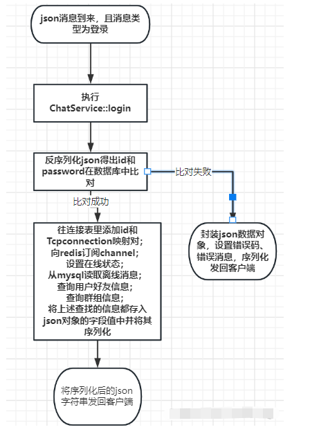
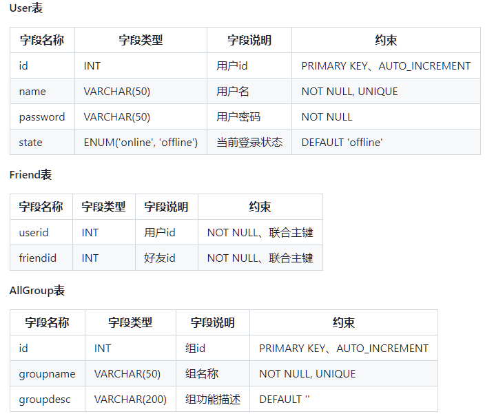

- [模块设计](#模块设计)
  - [网络层](#网络层)
  - [业务层](#业务层)
  - [数据层](#数据层)
- [聊天客户端实现](#聊天客户端实现)
- [负载均衡与跨服务器聊天](#负载均衡与跨服务器聊天)
  - [负载均衡模块](#负载均衡模块)
  - [Nginx 配置](#nginx-配置)
  - [跨服务器聊天](#跨服务器聊天)
  - [Redis](#redis)
    - [环境安装](#环境安装)
- [面试问题](#面试问题)

# 模块设计

> [模块分层设计](https://blog.csdn.net/qq_42120843/article/details/130255081)

项目对程序的不同功能进行分层设计，分为网络层、业务层和数据层。C++ 面向接口编程也就是面向抽象类。网络模块和业务模块需要尽量地解耦合。

## 网络层

网络层主要封装的是网络连接方面的一些功能，即 socket 相关操作，本项目采用 muduo 网络库作为网络层的底层开发。主要功能是设置**连接到来**和**消息到来**的回调设置以及服务器基本设置（若子 Loop 数、启动服务）。

本项目消息使用 `Json` 格式，通过**解析消息格式**来确定**调用业务层的某一具体功能**：

```cpp
/* 上报读写事件相关信息的回调函数 */
void ChatServer::onMessage(const TcpConnectionPtr& conn /* 连接 */,
                           Buffer* buffer /* 缓冲区 */,
                           Timestamp time /* 接收数据的时间信息 */) {
  std::string buf = buffer->retrieveAllAsString();
  // 数据的反序列化：解码
  json js = json::parse(buf);
  // 完全解耦网络模块的代码和业务模块的代码
  // 通过 js["msgid"] => 业务处理函数 => conn js time
  /**
   * 解释一下这里的逻辑调用：
   * 1. 首先将字符串流反序列化为 json 对象，然后根据 json 对象中的 msgid 获得业务模块中对应的业务处理函数。
   * 2. 根据 msgid 的值在一个 map 表中找到其对应的业务函数，然后给该业务函数传递三个参数，进行相应的业务处理。
   */
  auto msgHandler = ChatService::instance()->getHandler(js["msgid"].get<int>());
  // 使用业务模块的处理函数，来执行相应的业务处理
  msgHandler(conn, js, time);
}
```

## 业务层

业务层主要处理具体的业务，如登录业务、注册业务、一对一聊天业务、群聊业务等，其中业务类 `ChatService` 是一个**单例模式**。使用一个 `unordered_map` 来存储函数表，通过消息号 `msg_id` 来映射具体的业务处理函数，另一个 `unordered_map` 用来存储用户号 `userid` 与其对应的 `TcpConnectionPtr`，使其能够对某一客户端连接进行 IO 操作。

对于某一具体的业务，以**登录业务**为例，其流程如下：





**代码如下：**

```cpp
/* 处理登录业务：输入 id 和 密码 就行啦！还需要检查下 id 对应的 pwd 是否正确。 */
void ChatService::login(const TcpConnectionPtr& conn, json& js,
                        Timestamp time) {
  // std::cout << js << std::endl;
  int id = js["id"].get<int>();
  std::string pwd = js["password"];

  User user = userModel_.query(id);
  // std::cout << js << std::endl;
  if (user.getId() == id && user.getPassword() == pwd) {
    if (user.getState() == "online") {
      json response;
      response["msgid"] = LOGIN_MSG_ACK;
      // 1 表示有错
      response["errno"] = 1;
      response["errmsg"] = "This accout is using, input another!";
      // 发送序列化数据
      conn->send(response.dump());
    } else {
      // 登录成功，记录用户链接信息
      // 设计多线程访问，需要考虑其线程安全问题
      {
        // 在该作用域加锁，出了该作用域就解锁了
        std::lock_guard<std::mutex> lock(connMutex_);
        userConnMap_.insert({id, conn});
      }

      // id 用户登录成功后，向 redis 订阅 channel(id)
      redis_.subscribe(id);

      // 登录成功：更新用户的状态信息 state：offline => online
      user.setState("online");
      userModel_.updateState(user); 

      json response;
      response["msgid"] = LOGIN_MSG_ACK;
      // 0 表示没错
      response["errno"] = 0;
      response["id"] = user.getId();
      response["name"] = user.getName();

      /* 查询该用户是否有离线消息 */
      std::vector<std::string> vec = offlineMsgModel_.query(id);
      if (!vec.empty()) {
        response["offlinemsg"] = vec;
        // 读取该用户的离线消息后，把该用户的所有离线消息删除掉
        offlineMsgModel_.remove(id);
      }

      /* 查询该用户的好友信息并返回 */ 
      std::vector<User> userVec = friendModel_.query(id);
      if(!userVec.empty()){
        std::vector<std::string> vec2;
        for(auto user: userVec){/* 将每个用户序列化为字符串 */
          json js;
          js["id"] = user.getId();
          js["name"] = user.getName();
          js["state"] = user.getState();
          // dump() 函数是将 json 序列化为字符串
          vec2.push_back(js.dump());
        }
        // friends 存储的是多条字符串，每条字符串对应一个用户
        response["friends"] = vec2;
      }

      /* 查询用户的群组信息 */
      std::vector<Group> groupuserVec = groupModel_.queryGroups(id);
      if (!groupuserVec.empty()) {
        // group:[{groupid:[xxx, xxx, xxx, xxx]}]
        std::vector<std::string> groupV;
        for (Group& group : groupuserVec) {
          json grpjson;
          grpjson["id"] = group.getId();
          grpjson["groupname"] = group.getName();
          grpjson["groupdesc"] = group.getDesc();
          std::vector<std::string> userV;
          /* 每组内的每个用户使用字符串进行存储，一个用户对应一个字符串 */
          for (GroupUser& user : group.getUsers()) {
            json js;
            js["id"] = user.getId();
            js["name"] = user.getName();
            js["state"] = user.getState();
            js["role"] = user.getRole();
            userV.push_back(js.dump());
          }
          grpjson["users"] = userV;
          groupV.push_back(grpjson.dump());
        }
        response["groups"] = groupV;
      }
      // 发送序列化数据
      conn->send(response.dump());
    }
  } else {
    // 登陆失败：该用户不存在；用户存在但是密码错误
    json response;
    response["msgid"] = LOGIN_MSG_ACK;
    // 1 表示有错
    response["errno"] = 1;
    response["errmsg"] = "Id or password is invalid!";
    // 发送序列化数据
    conn->send(response.dump());
  }
}
```

其他业务处理函数都类似。

## 数据层

为了使**数据模块**和**业务模块**分离，加入了 `ORM`（Object Relation Model）类，也就是**将表的字段封装成一个类**并**提供对应的 `get` 和 `set` 方法**，业务层操作的都是对象，`DAO` 层（数据访问层）即 `Model` 类才能访问数据。

<font color=alice>如：`userModel` 层提供的方法接受的数据都是 `User` 对象，而不是直接传递裸数据。</font>

**`model` 类是 `db` 和 `ORM` 类的桥梁，`model` 类使用 `db` 类提供的方法，使用 `ORM` 类对象成员进行 `SQL` 的增删改查操作。**

<font color=blue>一般来说，该项目在**表数据量在 5w 以内都能比较高效地进行表查询操作**而**不需要修改表结构或者分库分表操作**。</font>




# 聊天客户端实现

> [客户端实现](https://blog.csdn.net/qq_42120843/article/details/130273621)

这部分并不是该项目的重点，而且客户端并没有高并发等这些要求，所以本项目只是做了差不多的客户端程序方便测试服务端程序。**注意服务器处理 `json` 数据解析的字段名和客户端封装 `json` 数据的字段需要一一对应**。

客户端程序中，**main 函数所在的主线程只用于接收用户输入以及数据的发送，子线程用于接收数据**。当客户端连接上服务器后就启动子线程进行轮询处理接收到的数据，并进行相应的处理。

<font color=blue>主线程初始化连接到服务端，然后显示**首页面菜单**</font>，1. 若选择登录且登录成功之后则进入**用户登录页面菜单**，<font color=alice>然后将登陆的用户信息发送给服务端，由服务端根据接收到的用户登录信息，然后给客户端发送信息，此时服务器发送的信息由**客户端的子线程**进行处理</font>；2.  若选择注册且注册成功之后，然后将注册的用户信息发送给服务端，由服务端根据接收到的用户注册消息，然后给客户端发送消息，此时服务端发送的消息由**客户端的子线程**进行处理；

总结下就是：**main 线程发送请求的 `json` 数据之后，就使用一个信号量进行 `sem_wait()` 在原地进行阻塞等待，子线程中进行 `doLoginResponse` 或者 `doRegResponse` 的逻辑处理，处理完成之后就使用 `sem_post()` 进行唤醒前面被阻塞的主线程**。然后在重新显示首页面菜单，进行功能选择。

# 负载均衡与跨服务器聊天

> [负载均衡模块与跨服务器聊天](https://blog.csdn.net/qq_42120843/article/details/130273639)

## 负载均衡模块

<font color=red> Q1：为什么要加入负载均衡模块？</font>

* 因为单台服务器顶多支持 2w 人在线聊天，3w 人就不能支持了。**可以使用 `Nginx` 把并发量提升到 5 万、6 万**。

<font color=red>Q2：使用负载均衡器 `Nginx` 的用处或意义？</font>

* 1）<font color=alice>把 Client 的请求按照**负载算法**分发到具体的业务服务器 `ChatServer` 上面。</font>客户端的请求以及服务端的响应都是要经过负载均衡器 `nginx` 的。
* 2）<font color=alice>能够和 `ChatServer` 保持**心跳机制**，监测 `ChatServer`上面的故障。</font>如 3 台服务器的信息都配置在负载均衡器上，使其保持长连接，网络环境复杂，发了三次心跳都没响应，说明网络不通、服务器不能正常提供服务了。
* 3）<font color=alice>能够发现新添加的 `ChatServer` 设备方便**扩展服务器数量**。</font>

**客户端和某台服务器可建立 IP 隧道，想要更大的并发量可以对负载均衡服务器再做集群。**

负载均衡模块在整个程序中的位置如下图：


## Nginx 配置

在服务器快速集群环境搭建中，都迫切需要一个能拿来即用的**负载均衡器**，`nginx` 在1.9版本之前，**只支持 `http` 协议 `web` 服务器的负载均衡**，从 `1.9` 版本开始以后，`nginx` 开始**支持 `tcp` 的长连接负载均衡**，但是 `nginx` 默认并没有编译 `tcp` 负载均衡模块，编写它时，**需要加入 `--with-stream` 参数来激活这个模块**。

```bash
# 1. 安装 Nginx 的工具和库依赖
sudo apt-get update
sudo apt-get install build-essential libpcre3 libpcre3-dev zlib1g zlib1g-dev libssl-dev

# 2. 下载、解压并安装 nginx
wget http://nginx.org/download/nginx-1.24.0.tar.gz
tar -zxvf nginx-1.24.0.tar.gz
cd nginx-1.24.0
./configure --with-stream # 激活 tcp 负载均衡模块
make
sudo make install

# 3. 运行 nginx
cd /usr/local/nginx/ # 进入 nginx 目录下
cd sbin/ # 可执行文件在 sbin 目录下
# 启动 nginx
sudo ./nginx
./nginx -s reload # 重新加载配置文件启动
./nginx -s stop # 停止 nginx 服务
# 终止 nginx 不能使用 kill 命令，因为有容错机制，怎么杀都杀不完，只能使用 ./nginx -s stop 来进行终止
```

`nginx` 配置 `tcp` 负载均衡：

```bash
cd conf # 进入 conf 文件夹
vim nginx.conf # 编辑该文件夹下的 nginx.conf 配置文件

# 添加以下代码
# nginx tcp loadbalance config
stream {
        # 负载均衡模块
        upstream MyServer{
                # 服务器名称 服务器ip:端口号 权重=1 max_fails=x fail_timeout=s
                # 上述权重=1，表示轮询的请求数
                # max_fails=3表示和ChatServer保持心跳机制，超过3次失败表示服务器挂掉了
                # fail_timeout=30s，响应时间超过30s表示失败了
                # 负载均衡器里面配置了两台服务器
                server 127.0.0.1:6000 weight=1 max_fails=3 fail_timeout=30s;
                server 127.0.0.1:6002 weight=1 max_fails=3 fail_timeout=30s;
        }

        server{
                proxy_connect_timeout 1s;
                # proxy_timeout 3s;
                listen 8000; # 表示 ngnix 会监听的端口号
                proxy_pass MyServer; # 表示标记
                tcp_nodelay on;
        }
}

# 配置完成之后，重启 nginx 即可
./nginx -s reload
```


**解释：**

* 1）以上配置表明：**客户端连接服务器时只需要填写端口号 `8000`**，就是连接到负载均衡器上了，它会帮助我们把请求分发到 `127.0.0.1:6000` 和 `127.0.0.1:6002` 端口上面了。
* 2）配置修改完成之后，重启 `nginx` 即可：`./nginx -s reload`。
* 3）**这么修改了之后，客户端连接服务端的地址都要为 `127.0.0.1:8000`，也就是连接到负载均衡器上而不是服务器的具体端口上了**。

***
客户端通过 `nginx` 登录服务器：


***

查看 `nginx` 是否在 80 端口启动（因为其本身是一个 HTTP 服务器，工作在 80 端口；**客户端应该连接 `8000` 端口，该端口是用来进行负载均衡的端口**）：

```bash
# 查看 nginx 服务是否启动
netstat -tanpbash
```


## 跨服务器聊天

**背景：当 `ChatServer` 集群部署到多台服务器时，当客户端登录到不同的服务器时，如何解决跨服务器通信问题呢？**

* 1）若采用**服务器两两之间建立连接**，也就是**让各个 `ChatServer` 服务器之间直接建立 TCP 连接进行通信，相当于是在服务器网络之间进行广播**。缺点也显而易见，<font color=red>这样设计会使得各个服务器之间的耦合度太高，不利于系统扩展，并且会占用系统大量的 socket 资源，各个服务器之间的带宽压力很大，不能够节省资源给更多的客户端提供服务，因此绝对不是一个好的设计。</font>


* 2）集群部署的服务器之间进行通信，最好的方式就是引入**中间件消息队列**，解耦各个服务器，使整个系统松耦合，提高服务器的响应能力，节省服务器的带宽资源。在集群分布式环境中，经常使用的中间件消息队列有 `ActiveMQ`、`RabbitMQ`、`Kafka` 等，都是应用场景广泛且性能很好的消息队列，**这些消息队列供集群服务器之间、分布式服务之间进行消息通信**。


## Redis 

### 环境安装

```bash
# 安装 redis 服务
sudo apt-get install redis-server
# 查看 redis 的服务端口
ps -ef | grep redis

# redis 客户端登录
redis-cli
```

`redis-cli` **消息通信演示：**


`redis` 的发布-订阅模式包含两种角色，**一是消息的发布者，而是消息的订阅者**。

* 订阅者可以订阅一个或者多个通道 channel，发布者可以向指定的通道 channel 发送消息，所有订阅该通道的订阅者都能收到此消息。
* 订阅通道的命令是 `subscribe`，可以同时订阅多个通道，用法为 `subscribe channel1 [channel2...]`。**执行订阅命令后，则该客户端处于订阅阻塞状态，等待该 channel 上的消息**。进入订阅状态的客户端，只能使用发布订阅的命令，如 `subscribe`、`unsubscribe`、`psubscribe` 和 `punsubscribe` 这四个发布/订阅命令，否则会报错。
* 进入订阅状态后客户端可能收到 3 种类型的回复。**每种类型的回复都包含 3 个值，第一个值是消息的类型，根据消类型的不同，第二个和第三个参数的含义可能不同**。`subscribe`:表示订阅成功的反馈信息，第二个值是订阅成功的频道名称，第三个是当前客户端订阅的频道数量；`message`：表示接收到的消息，第二个值表示产生消息的频道名称，第三个值是消息的内容。`unsubscribe`：表示成功取消订阅某个频道。第二个值是对应的频道名称，第三个值是当前客户端订阅的频道数量，当此值为 `0` 时客户端会退出订阅状态，之后就可以执行其他**非"发布/订阅"模式**的命令了。


### 原理解释

**发布-订阅模式的 `Redis` 消息队列**采用的是**观察者模式**的使用场景（观察者模式是用来观察到事件的发生的）。`Redis` 不仅可以作为消息队列，而且可以作为**键值对存储的缓存数据库**，是**基于内存存储数据**的，它的数据也可以**持久化到磁盘上**。

**消息队列是长连接跨服务器聊天的通用方法，工作流程如下**：

* 1）客户端 `c1` 在登录上某个服务器的连接后，要把该连接在 `redis` 队列上订阅 `subscribe` 一个通道 `ch1`。
* 2）别的客户端 `c2` 在不同的服务器上登录上，要给 `c1` 发消息的话会直接发送到 `redis` 队列上的通道 `ch1`，客户端 `c1` 可接收到信息发布 `publish` 到通道 `ch1`。
* 3）需要开**一个单独线程进行监听通道上的事件，有消息给业务层上报**。
* 4）当服务器发现发送的对象 `id` 没有在自己的`_userConnMap`上，就要往消息队列上`publish`，消息队列就会把消息发布给订阅者。

`Redis` 服务器后台运行输入如下指令：

```bash
redis-server --daemonize yes
```

### redis 发布-订阅的客户端编程

`redis` 支持多种不同的客户端编程语言，`java` 对应 `jedis`、`php` 对应 `phpredis`、`c++` 对应 `hiredis`。

```bash
# 下载安装 hiredis
git clone https://github.com/redis/hiredis
cd hiredis
make # 编译
sudo make install # 安装用户库目录/usr/local/lib下
sudo ldconfig /usr/local/lib
```


发布订阅功能要开两条 `redis` 连接即两个 `redisContext *`，一条用于订阅和接收消息，一条用于发布消息，这么做的原因是因为订阅  `SUBSCRIBE` 时会进入阻塞状态，代码如下：

```cpp
/* 向 redis 指定的通道发布消息 */
bool Redis::publish(int channel, std::string message) {
  /* command 表示命令，相当于是敲了 publish 命令 */
  /**
   * redisCommand() 先把要发送的命令缓存到本地，然后调用 redisAppendCommand()， 
   */
  redisReply *reply = (redisReply *)redisCommand(
      publish_context_, "PUBLISH %d %s", channel, message.c_str());
  if (nullptr == reply) {
    std::cerr << "publish command failed!" << std::endl;
    return false;
  }
  /* 释放资源 */
  freeReplyObject(reply);
  return true;
}

/* 向 redis 指定的通道订阅消息 */
bool Redis::subscribe(int channel) {
  // SUBSCRIBE 命令本身会造成线程阻塞等待通道里面发生消息，这里只做订阅通道，不接收通道消息
  // 通道消息的接收专门在 observer_channel_messag e函数中的独立线程中进行
  // 只负责发送命令，不阻塞接收 redis server 响应消息，否则和 notifyMsg 线程抢占响应资源
  if (REDIS_ERR ==
      redisAppendCommand(this->subcribe_context_, "SUBSCRIBE %d", channel)) {
    std::cerr << "subscribe command failed!" << std::endl;
    return false;
  }
  // redisBufferWrite 可以循环发送缓冲区，直到缓冲区数据发送完毕（done被置为1）
  int done = 0;
  while (!done) {
    if (REDIS_ERR == redisBufferWrite(this->subcribe_context_, &done)) {
      std::cerr << "subscribe command failed!" << std::endl;
      return false;
    }
  }
  return true;
}
```

本项目使用 `hiredis` 进行 `redis` 编程，加入 `redis` 的发布订阅消息队列后，业务层的改动大致如下：

* `chatservice` 构造中连接 `redis` 即调用 `connect`，并设置上报消息的回调，`connect` 中会开启一条新线程调用 `observer_channel_message()` 函数进行循环接收订阅通道上的消息，有消息到来给业务层上报。
* 登录时订阅 `subscribe channel`。
* 聊天时遇到用户在别的服务器上登录（`userid` 不在 `map` 中，但状态为 `online`）就 `publish`
* 注销就取消订阅 `unsubscribe channel`。


`Redis` 的相关考察问题。Kafka 分布式消息队列。

 

# 面试问题


reference：

* 博客：[基于muduo和nginx的集群聊天服务器项目](https://juejin.cn/post/7194411400293253157)、重点参考--[集群聊天服务器项目（C++ 11实现）](https://blog.csdn.net/weixin_46272577/article/details/126996475)、[基于muduo网络库的集群聊天系统](https://blog.nowcoder.net/n/1c02731f5b344dd7892974a9da7160f7?from=nowcoder_improve)、全面--[集群聊天服务器](https://blog.csdn.net/m0_73537205/article/details/139056143)
* github：https://github.com/Cdreamfly/ClusterChatServer、https://github.com/shenmingik/Server、https://github.com/Shangyizhou/Cluster-Chat-Server、